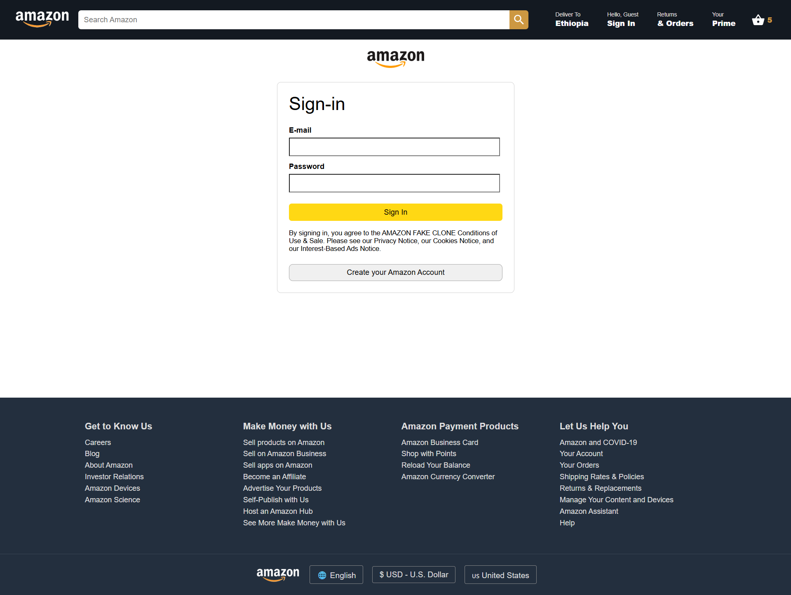
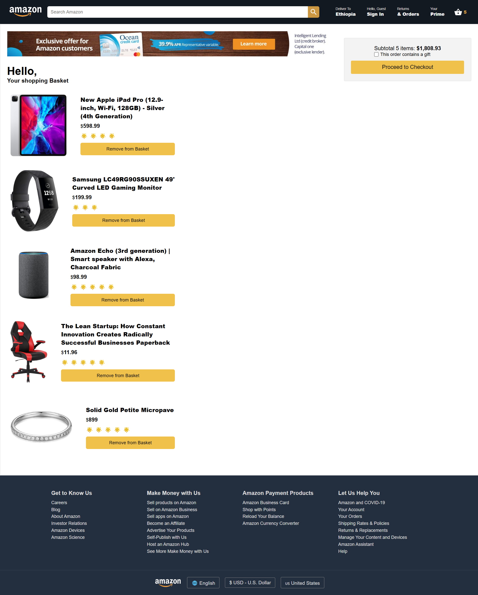
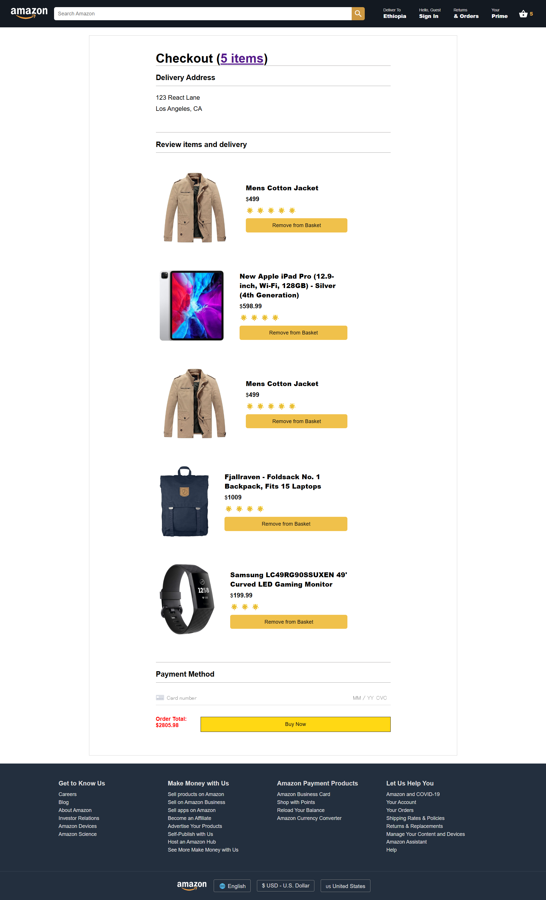

Absolutely! Here's your complete, polished `README.md` file with:

* Features section
* Responsive image previews (smaller width)
* Full installation guide for **Create React App frontend** and **Node/Express backend**
* Firebase + Stripe environment setup
* Clean formatting ready for GitHub

---

````markdown
# 🛒 Amazon Clone

A full-stack e-commerce web application that mimics core functionalities of Amazon. Built with **React** for the frontend, **Node.js + Express** for the backend, **Firebase** for authentication, and **Stripe** for secure payments.

---

## ✨ Features

- 🔐 **User Authentication** (Sign Up / Sign In) with Firebase
- 🛍️ **Product Listing** and dynamic rendering
- 🛒 **Add to Cart**, **Remove from Cart**, and **Order Summary**
- 💳 **Stripe Payment Integration** with real-time confirmation
- 📦 **Order History** (stored and retrieved for logged-in users)

---

## 🖼️ Preview

### 🏠 Home Page


### 🔐 Login Page


### 🛒 Checkout Page


### 💳 Payment Page


---

## 🛠️ Tech Stack

| Frontend        | Backend      | Auth & Payment  |
|-----------------|--------------|-----------------|
| React (CRA)     | Node.js      | Firebase Auth   |
| Context API     | Express.js   | Stripe API      |
| React Router    | REST API     | Stripe Webhooks |

---

## 🧰 Installation

### 1. Clone the Repository

```bash
git clone https://github.com/your-username/amazon-clone.git
cd amazon-clone
````

---

### 2. Set Up the Frontend (React - Create React App)

```bash
cd client
npm install
```

Start the frontend:

```bash
npm start
```

This will run the app on:
👉 [http://localhost:3000](http://localhost:3000)

---

### 3. Set Up the Backend (Node.js + Express)

```bash
cd ../server
npm install
```

Create a `.env` file inside the `server` directory and add your Stripe secret key:

```env
PORT=5000
STRIPE_SECRET_KEY=your_stripe_secret_key
```

Start the backend server:

```bash
npm run dev
```

This will run the backend on:
👉 [http://localhost:5000](http://localhost:5000)


## 📁 Project Structure

```
amazon-clone/
├── client/               # React frontend
│   ├── src/
│   ├── public/
│   ├── .env
│   └── package.json
├── server/               # Node.js backend
│   ├── routes/
│   ├── controllers/
│   ├── .env
│   └── index.js
├── screenshots/          # UI preview images
├── README.md
└── package.json
```

---


